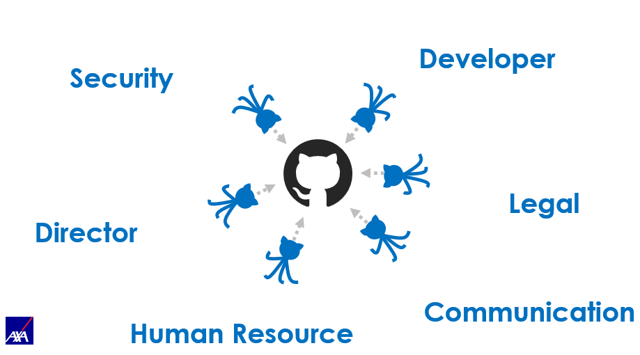

# Open Source Workflow

- [Third Party Contribution](#third-party-contribution)
- [Open Source A Library Or An Application](#open-source-a-library-or-an-application)

## Third Party Contribution

You are encouraged to contribute to third party repositories during your work time:

- The subject must be related to a problem of your project or work
- Your manager must be notified

## Open Source A Library Or An Application

Workflow to follow in order to **Open Source** a library or an application.

### Why a workflow

This workflow help to align all the actors of an entity on the same objectives.

whithout a workflow :

with a workflow :

## 1) Prerequisites

Please consider to be **Open Source First**:

- More feedbacks
- Iterate quicker (open source does not mean to be perfect, but on the way to be perfect quicker)

### Prerequisites for starting a new pure technical asset "Open Source First" or public activity material (workshops, talks, resources for blog post)

- No business rule specific to AXA
- License ([MIT](https://github.com/AxaFrance/react-oidc/blob/master/LICENSE) / Apache v2)
- Mandatory files : README.md, CONTRIBUTING.md, CODE_OF_CONDUCT.md, LICENSE.md, CHANGELOG.md, Templates : Issues, PR
- At least one “Repository Maintainer“

### Prerequisites for an existing internal technical asset

- No business rule specific to AXA
- Code quality & practices
  - At least 60% of code coverage
- CI (Continuous Integration) with all the internal tools
- License: [MIT](https://github.com/AxaFrance/react-oidc/blob/master/LICENSE)
  - please note that you have to "Copy/Paste" the licence text because it has to specify the entity "AXA France IARD / AXA France VIE"
- Mandatory files : README.md, CONTRIBUTING.md, CODE_OF_CONDUCT.md, LICENSE.md, CHANGELOG.md, Templates : Issues, PR
- At least one “Repository Maintainer“

## 2) Validations

- Technical director of the entity
- Security validation

## 3) Team/Maintainer Must

Checklist for repository creation:

- Write a repository description
- Add `axa` topic and some of following topics that match those referenced on our GitHub organization page (`data`, `ai`, `ml`, `green`, `test-automation`, `security`, `tools-engineering`, `raise-the-bar`, `front-end-development`, `csharp`, `dotnet`, `java`, `python`)
- Consider adding a social media preview

Checklist to set up contributions management:

- Set up protection rules on the `main` branch with code review enforcement
- Use commit signature verification using your @axa.fr email on GitHub ([see documentation](https://docs.github.com/authentication/managing-commit-signature-verification/about-commit-signature-verification))
- Use and enforce two-factor authentication everywhere it is possible: GitHub, npm, nuget, etc.
- Set up and maintain CI / CD
  - use GitHub Action
  - use https://sonarcloud.io/organizations/axaguildev
- Consider configuring code owners ([see documentation](https://docs.github.com/repositories/managing-your-repositorys-settings-and-features/customizing-your-repository/about-code-owners))

Follow these guidelines for all contributions:

- Keep tokens, secrets and certificates private
- Manage the roadmap
- Manage “Issues” and “PullRequests”
- Help to grow the community

## 4) Mentality

- Going Open Source brings and requires a change of mentality within development teams.

## 5) Repository end of life

When the asset becomes deprecated and unused, the repository will no longer be updated.

- Archive the repository
- If necessary, change the visibility to private
